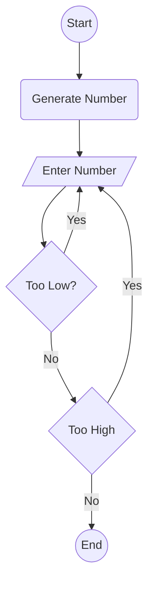

# Guessing Game

## Flowchart Steps
- Start game is at node A
- Computer generates a number at node B
- User enters a number at node C
- Node D is a decision point, if too low it goes back to node C else goes to node E
- Node E is another decision point, if too high it goes back to node C else it goes to node F
- Node F is the end of the game